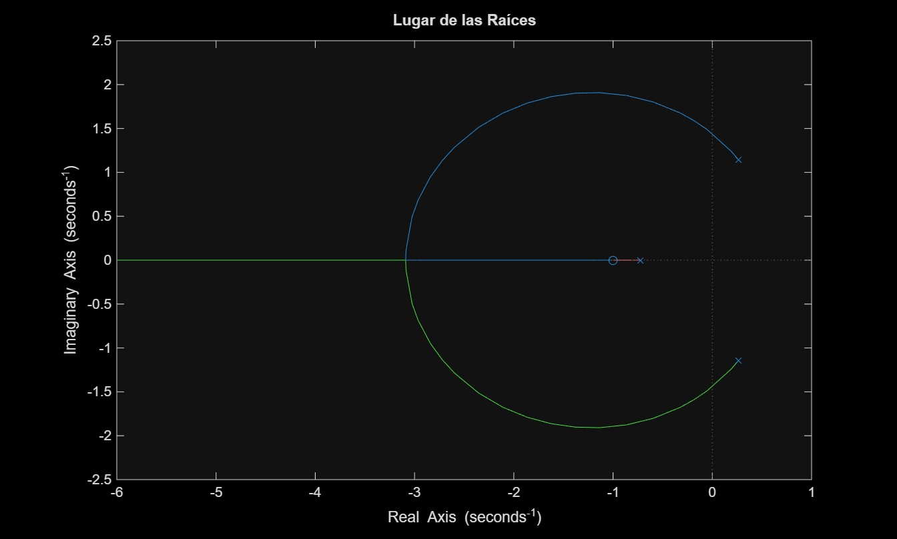
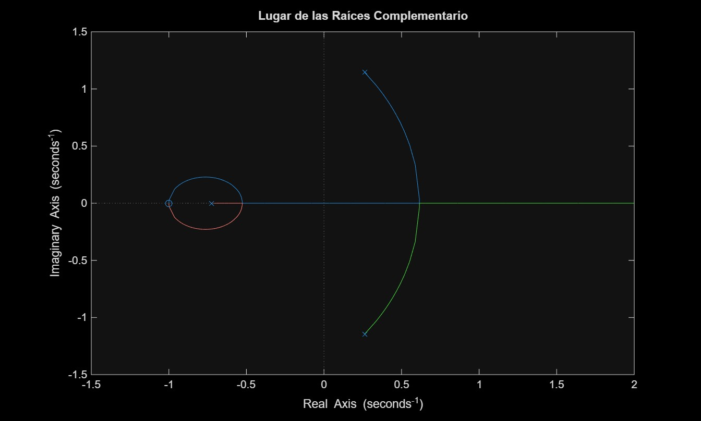
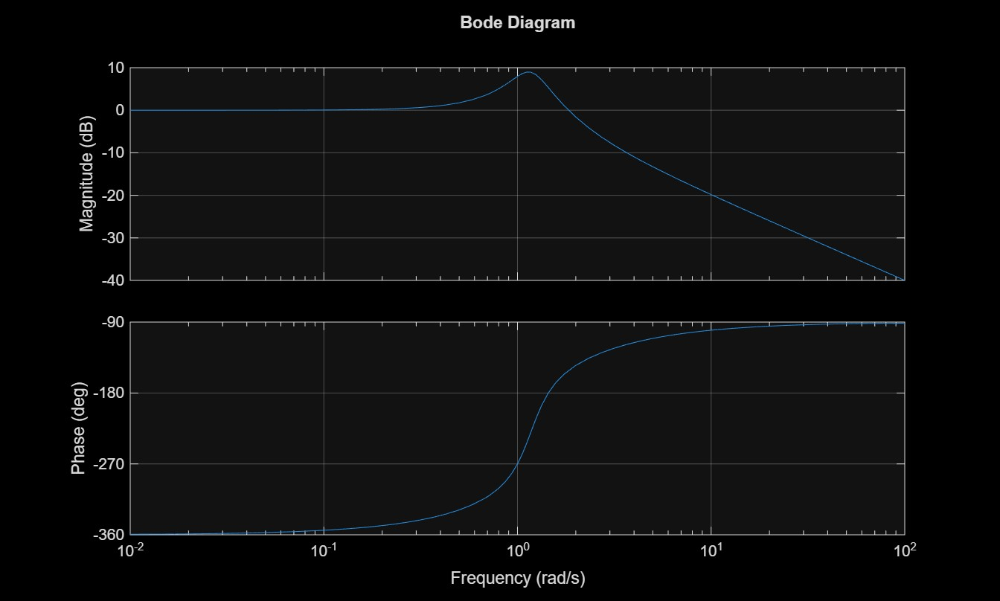
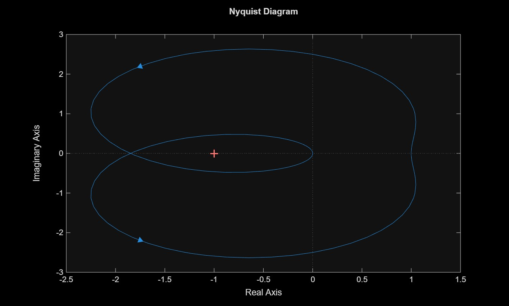

# Taller Estabilidad de Sistemas Realimentados

Señales y Sistemas II
Entregado por:
- Andrea Alejandra Suárez Cuervo
- Daniel Felipe Loy Arias

---
## Descripción

En el presente taller se aborda el análisis de estabilidad de dos sistemas realimentados simples con la misma estructura de ganancia de lazo abierto, pero estudiados en dominios diferentes: uno en tiempo continuo, descrito en el dominio de Laplace mediante GH(s), y otro en tiempo discreto, descrito en el dominio Z mediante GH(z). Esta comparación permite evidenciar tanto las similitudes conceptuales como las diferencias metodológicas entre ambos enfoques de análisis.

---
## Primer Punto

Contiene el análisis de estabilidad del sistema realimentado continuo:

GH(s) = (s² + 2s + 1) / (s³ + 0.2s² + s + 1)

Se determina el rango de valores de la ganancia K para el cual el sistema es estable, 
utilizando cuatro métodos complementarios:

- Criterio de Routh-Hurwitz
- Lugar de las Raíces y Lugar de las Raíces Complementario
- Diagramas de Bode
- Criterio de Nyquist

### Resultado principal

El sistema es estable para:

**K > 0.5403**

En K ≈ 0.5403 el sistema presenta un par de polos puramente imaginarios en ±j1.4424 rad/s, punto en el cual el sistema pasa de inestable a marginalmente estable. (ver [desarrollo analítico a mano](imagenes/desarrollo.jpeg))

### Gráficas

#### Lugar de las Raíces



#### Lugar de las Raíces Complementario



#### Diagrama de Bode


### Diagrama de Nyquist


### Verificación cruzada de resultados

| Método | Valor crítico obtenido |
|---|---|
| Routh-Hurwitz | K ≈ 0.5403 |
| Lugar de las Raíces | cruce en ω ≈ ±1.4424 rad/s |
| Bode | \|GH(jω)\| = 5.35 dB → 1/K = 1.8507 → K ≈ 0.5403 |
| Nyquist | corte en eje real en −1.8506 ≈ −1/K → K ≈ 0.5403 |

Los cuatro métodos coinciden, confirmando la consistencia del análisis.

---

## Segundo Punto


---

## Contenido del repositorio

| Archivo | Descripción |
|---|---|
| `punto1.m` | Script principal de MATLAB con todo el análisis del primer punto |
| `punto2.m` | Script principal de MATLAB con todo el análisis del segundo punto|
| `imagenes/` | Gráficas generadas (Lugar de las Raíces, Bode, Nyquist), y cálculos a mano |

## Requisitos

- MATLAB
- Control System Toolbox

## Cómo ejecutar

```matlab
punto1
```
```matlab
punto2
```

El script genera las 4 figuras y muestra en la terminal los valores de los polos, magnitud/fase de Bode y parte real/imaginaria de Nyquist en el punto crítico.
